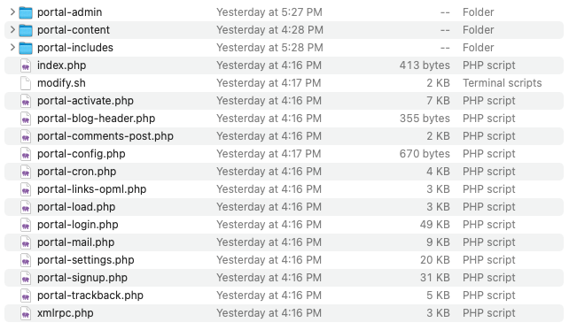

# wordpress-modification
shell script to modifiy wordpress default structure `directory naming` and also create config depend on declared variables

## Steps :
- add `modify.sh` script to root wordpress directory 
- open script file and edit  db credentials and prefix variables with yours 
- run it `bash modify.sh` 

## Screen Shot 

